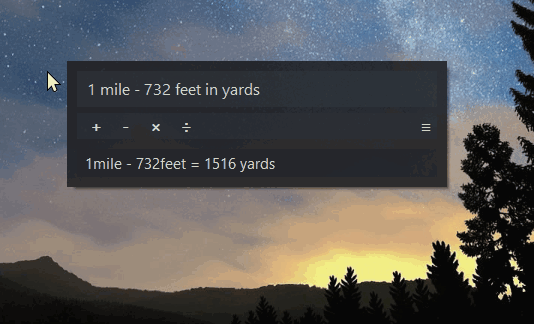

# Calico - Always-Open Floating Calculator for Windows

Calico is a lightweight floating calculator that appears instantly at your cursor with a hotkey. Do quick math, conversions, time calculations, and more without leaving the app you're using. Click away and it instantly hides, keeping your workflow uninterrupted.

## Highlights

- Configurable global hotkey to open near the cursor
- Borderless dark UI and live calculations while typing
- Right-click or click the `≡` icon for the insert menu
- History stores committed results for quick reuse
- Commands: `!help`, `!8ball`, `!roll`, `!clear`, `!exit`, `!settings`

## Math Input

- Operators: `+ - × ÷ * / ^ ( )`
- Unary `+` and `-`, decimals, nested parentheses, and exponentiation
- Percent handling:
  - `20%` = `0.2`
  - `30 + 10%` applies `10%` of `30`
  - `15% of 80` = `12`
- Spacing is optional
- History display is rounded for readability, while stored answers keep higher precision

## Units And Conversions

- Length: `in`, `ft`, `yd`, `m`, `cm`, `mm`, `km`, `mi`, `nmi`, `ly`
- Temperature: `°C`, `°F`, `K`
- Time: `ns`, `µs`, `ms`, `s`, `min`, `h`, `day`, `week`, `month`, `year`
- Area: `sq in`, `sq ft`, `sq yd`, `sq m`, `sq km`, `sq mi`, `acre`, `hectare`
- Weight: `mg`, `g`, `kg`, `oz`, `lb`, `ton`
- Volume: `ml`, `l`, `fl oz`, `cup`, `pint`, `quart`, `gallon`, `tbsp`, `tsp`
- Memory: `bit`, `byte`, `KB`, `MB`, `GB`, `TB`

### Conversion Syntax

- `5 km = mi` -> `3.106856 miles`
- `72 °F to °C` -> `22.222222 °C`
- `convert 100 square feet to square meters` -> `9.290304 square meters`
- `1 gallon in liters` -> `3.785412 liters`
- `8 GB to MB` -> `8000 MB`
- Feet and inches shorthand is supported: `5' 3"`

## Comparison Queries

Ask comparison questions and get a Yes or No explanation:

- `is 5 km > 3 miles`
- `is 100 °F < 40 °C`
- `is 2 hours = 120 minutes`

Supported operators: `>`, `<`, `>=`, `<=`, `=`, `==`, `!=`, `≥`, `≤`, `≠`

## Time Queries

- `now`
- `current time`
- `until 12/25/2026 16:45`
- `since 1/1 9:00 PM`
- `between 06/01 8:00 and 06/15 20:00`
- `weeks until 12/25/2026`
- `years since 1/1/2020`
- `weeks between 06/01/2026 08:00 and 06/15/2026 08:00`

Supported unit prefixes for duration queries: `seconds`, `minutes`, `hours`, `days`, `weeks`, `months`, `years`

Date formats:

- `M/D`
- `M/D/YYYY`
- textual month names such as `December`, `December 2026`, or `December 25 2026`
- supported holiday names such as `Christmas`, `Thanksgiving 2026`

Time formats:

- `HH:MM`
- `h:mm AM/PM`

## Holiday Queries

Ask about supported US holidays and get dates or countdowns:

- `days until halloween`
- `christmas`
- `thanksgiving 2024`
- `is today a holiday`

Supported holidays:

- New Year's Day, New Year's Eve
- Martin Luther King Jr. Day, Presidents' Day
- Valentine's Day, Mother's Day, Father's Day
- Memorial Day, Independence Day, Labor Day
- Columbus Day, Halloween, Veterans Day
- Thanksgiving, Christmas Eve, Christmas Day

  More to come.

## Commands

### `!help`

Shows the available commands.

### `!8ball [optional question]`

Returns a random Magic 8-Ball style response.

### `!roll [dice notation] [modifiers]`

Examples:

- `!roll 6`
- `!roll d6`
- `!roll 2d6`
- `!roll d20 + 5`
- `!roll 3d6 + 2 - 1`

Validation rules:

- Dice count: `1` to `100`
- Die sides: `2` to `1000`
- Invalid trailing text is rejected

### `!clear`

Clears history.

### `!exit`

Closes the app.

## Insert Menu

Access it with right-click or the `≡` icon.

- Operators: `+ - × ÷ ^ ( ) %`
- Length, area, weight, volume, memory, temperature, and time units
- Time menu includes `ns`, `µs`, `ms`, `s`, `min`, `h`, `day`, `week`, `month`, `year`
- Supported holidays for quick insertion

Settings are stored per-user in `%AppData%\\Calico\\Calico.ini`

